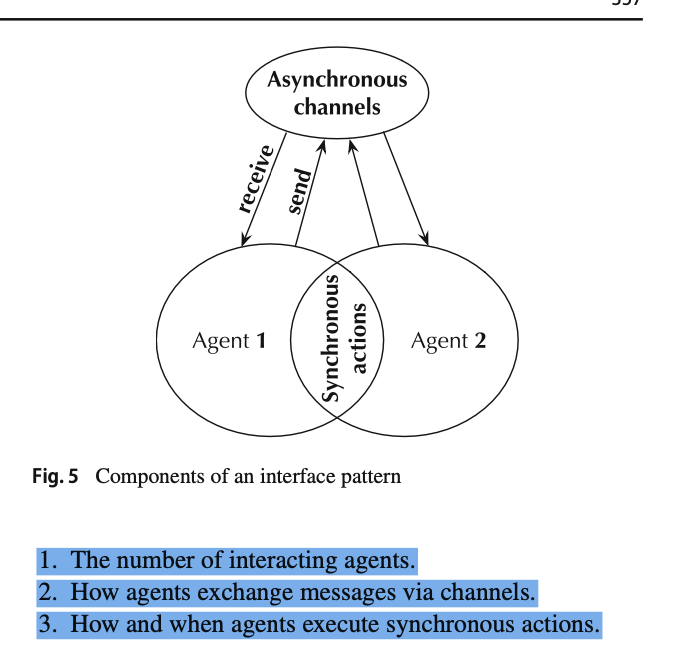
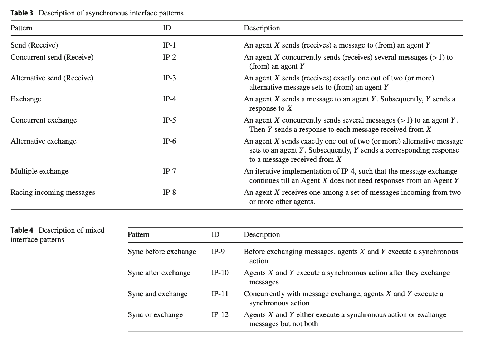

# Interfaces

A specification of agent interactions is called an interface. It represents the key interaction-oriented viewpoints of the architecture of a multi-agent system.

An interface pattern is a GWF-net that:
- Provides a highly abstract view of agent interactions without exposing internal agent behavior;
- Has a part representing the behavior of each agent.

## Interface Patterns

Table 3 considers interface patterns developed using ser- vice interaction patterns presented in [8]. Single transmission patterns, IP-1, IP-2, and IP-3, describe rather primitive agent interactions since a sending agent is not supposed to receive an acknowledgment from the other agent. 

Various ways of asynchronous message exchange are given in patterns IP-4, IP-5, and IP-6.

Interface pattern IP-7 describes multiple trans- mission interactions when one agent can decide to stop the exchange by sending a corresponding message to the other agent.

Multilateral interactions among three or more agents are described in IP-8. According to the specification of this pattern, one of the agents expects to receive one of sev- eral messages incoming from the other agents. Sending agents should be properly notified whether their messages are received.

Table 4 describes mixed interface patterns. They combine asynchronous and synchronous agent interactions. Patterns IP-9 and IP-10 extend pattern IP-4 such that agents synchro- nize either before or after messages are exchanged. 

Pattern IP-11 extends pattern IP-5 such that agents synchronize and exchange messages concurrently. 

Pattern IP-12 allows agents to either execute a synchronous activity or exchange mes- sages. This corresponds to an extension of pattern IP-6.

## Generalized Workflow Nets

Various Petri net classes can be used to model the behavior of a multi-agent system. We will use generalized workflow (GWF) nets equipped with initial and final states. They differ from classical workflow nets [6] in allowing initial and final states to be sets of places rather than singletons. For instance, the Petri net shown in Fig. 1 is also a GWF-net with three initial places and two final places, while the behavior of Agent 2 is a classical workflow net.

Workflow (WF) nets [6] are basic models used in process discovery. A WF-net is a Petri net with a distinguished initial and final place. The execution of a trace in an event log corre- sponds to the execution of a WF-net from its initial to its final place. For a more convenient representation of multi-agent systems, we generalize WF-nets, allowing sets of initial and final places rather than singletons.
